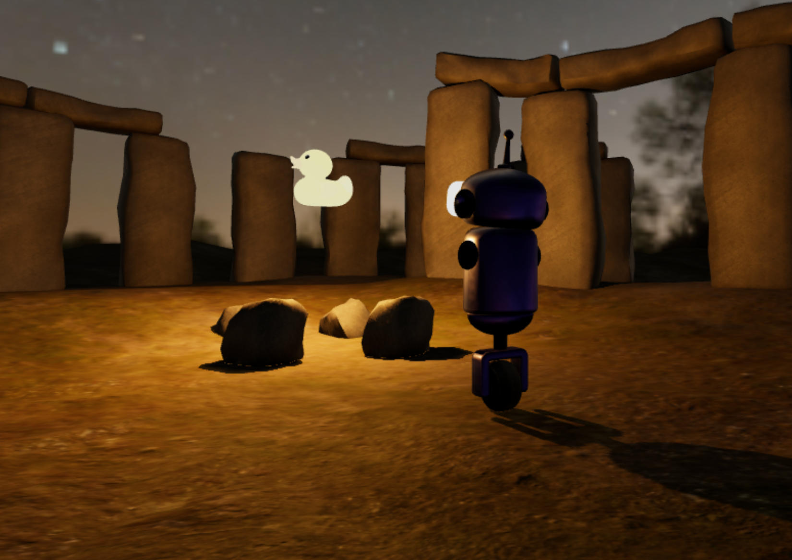

# HubHenge

This is a Blender project for use with Mozilla Hubs. It demonstrates lightmaps and HDR environment maps with the goal of "looking good" in both lit and unlit quality modes. It aspires to represent "best practice" and function as a reference project.

Note: the project will not export from Blender correctly without the [hdr-lightmaps](https://github.com/MozillaReality/hubs-blender-exporter/pull/35) and [shadow component](https://github.com/MozillaReality/hubs-blender-exporter/pull/39) changes.

## Models

The core of the scene is a Stonehenge model. The original UVs were designed for baked albedo so they had to be seamed and reprojected for use with new repeating textures.

A range of models (ducks) were added with different PBR roughness and metalic values as reference.

## Materials

High quality PBR textures with multiple channels (base, normal, roughness, etc...) but modest resolution (1K) were used in most cases to emphasise the advantages of lightmapping: i.e. low resolution repeating textures can look realistic with a low resolution lightmap over the top.

Some of the textures had a normal map in EXR format despite the pixels being in SDR range. There were some anomolies in the lighting of the exported GLTF file (with automatically converted PNGs), so they were converted explicitly instead, which seemed to fix the problem.

## Lighting

Light comes from two sources: a HDR envionment and a point light source. For aesthetics the point light is hidden inside a glowing duck model, which does not interfere with the light cast.

There is a [Blender export bug](https://github.com/KhronosGroup/glTF-Blender-IO/issues/564) that lights exported with the KHR_lights_punctual extension have the wrong units. In Hubs there is actually a "Point Light" component, so that was added to the light node and "Punctual Lights" disabled in the GLTF export. The light Range was set to be high because if Hubs finds a zero range it overrides the Decay property to be zero, which isn't consistent with "physically-correct" lighting in Three.js where the Decay should be 2.

Two HDR environments are included in the project: one for day and another for night. In outdoor daytime or brightly lit indoor scenes it is expected that an environment map will provide realistic enough lighting. In indoor scenes, particularly when the light source is close to the subjects, then punctual lights are required to improve realism.

The HDR environments are deliberately low resolution to emphasise that you don't need 8K assets for baking or for real-time reflections. That said, using the same image for the skybox looks bad so it would be better to substitue a higher resolution SDR texture for this purpose. This could use texture compression, which is currently not supported for the HDR environment texture.

To switch between day and night you must change the HDR texture used by the World material, change it to be the same in the Hubs environment component, and switch the three materials using lightmaps to use the corresponding day or night image texture.

The Mozilla "shadow" component was added to most of the models so they cast and receive shadows accordingly.

## Lightmaps

The MOZ_lightmap extension is used to pass a HDR lightmap texture to the rendering engine. The lightmap is shared by three materials and is still only 1K resolution; lightmaps are particularly forgiving of up-sampling because shadows are usually quite blurry.

Baking lightmaps in Blender is fiddly, but here are some tips that were followed:

- Use a HDR image for the target texture to capture overblown lighting. Currently .hdr (radience) format is the only one supported by Hubs.
- Use a second UV set for each target mesh and use the same name in all cases.
- Pack your texture carefully so that there is a gap between all the UV islands. Too close together and they will bleed into each other in the mipmaps, too far apart and you are wasting pixels. UVPackMaster2 was used to get a good quality layout, but the "perfect" process has yet to be determined.

## TODO

- The navmesh needs fixing, but knife project wouldn't let me cut the stones out.
- Light levels are not exactly the same in Blender and three.js.
- Consider how texture compression would best be applied.

## Attribution

[Stonehenge](https://sketchfab.com/3d-models/stonehenge-37cfc2bb99944703b5d57ea281030ca6) by ruslans3d

[Log](https://sketchfab.com/3d-models/log-27624ee05fea49899ba2a63e2f6d1e34) by Arkikon

[Abandoned Hopper Terminal 04](https://polyhaven.com/a/abandoned_hopper_terminal_04) by Sergej Majboroda

[Dikhololo Night](https://polyhaven.com/a/dikhololo_night) by Greg Zaal

[Bark Brown 02](https://polyhaven.com/a/bark_brown_02) by Rob Tuytel

[Rock 01](https://polyhaven.com/a/rock_01) by Rob Tuytel

[Aerial Grass Rock](https://polyhaven.com/a/aerial_grass_rock) by Rob Tuytel

[Duck](https://github.com/KhronosGroup/glTF-Sample-Models/tree/master/2.0/Duck)

